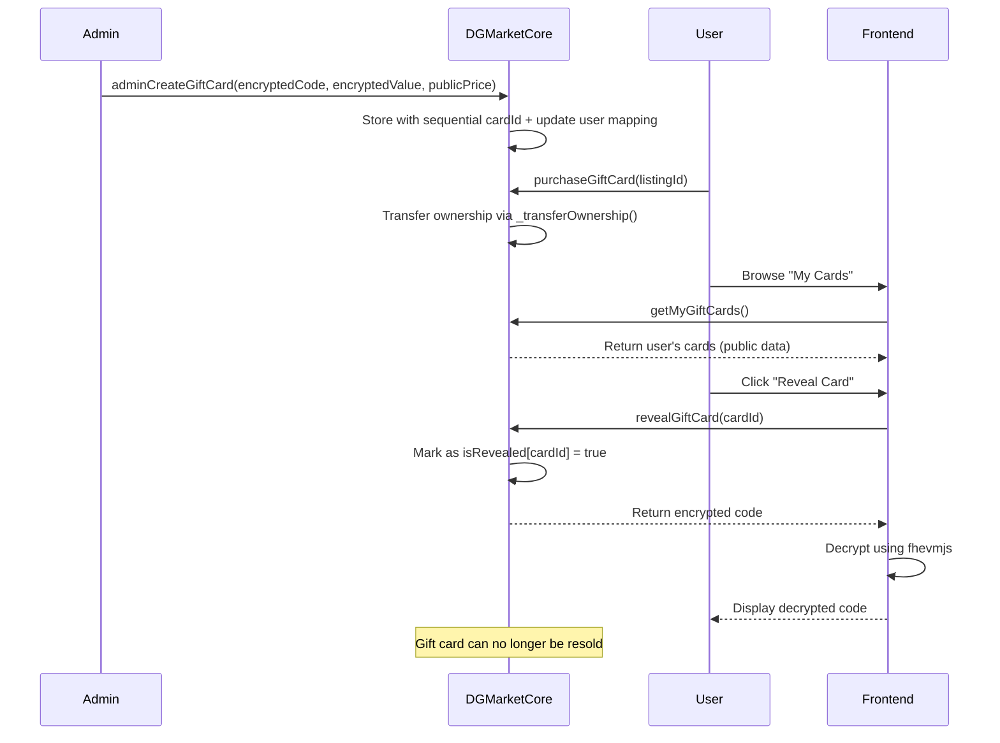
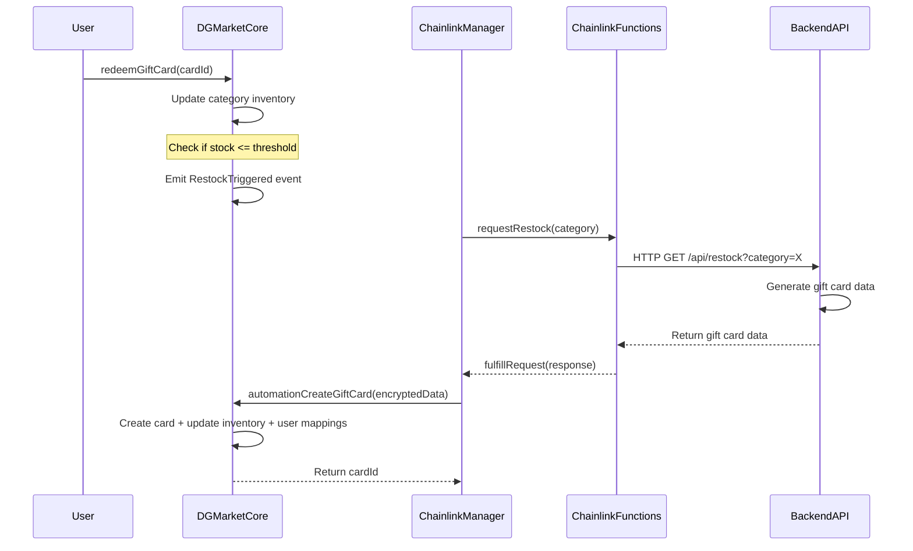

# DG Market

A decentralized gift card marketplace using Inco Lightning's Fully Homomorphic Encryption (FHE) for confidential gift card values and Chainlink Functions for automated gift card restocking.

## Features

- **Privacy-First Design**: Encrypted gift card values using Inco Lightning FHE
- **Multi-Token Support**: Accept payments in various ERC-20 tokens
- **Simplified State-Based Ownership**: Clean address-based gift card ownership tracking
- **Autonomous Restocking**: Automated gift card inventory management via Chainlink Functions
- **Owner-Only Access**: Only gift card owners can view and decrypt their gift card values
- **Resale Restrictions**: Once a gift card is revealed, it cannot be resold
- **Admin-Only Creation**: Only authorized admins and automation can create gift cards
- **Public Price Display**: Gift card prices are publicly visible for browsing

## Tech Stack

### Frontend
- Next.js 13.5, React 18
- Wagmi v2, Viem v2
- fhevmjs for FHE encryption
- Radix UI, shadcn/ui components
- Zustand, React Query
- Frontend is ready - check the codebase in @frontend directory

### Backend
- Node.js with Express
- Ethers.js for blockchain interaction
- fhevmjs for gift card value encryption
- Winston for logging
- Axios for API requests
- Event monitoring for automated restocking

### Smart Contracts (2-Contract Architecture)
- Solidity 0.8.24
- OpenZeppelin contracts
- Chainlink Functions v1.0.0
- Inco Lightning FHE
- **DGMarketCore.sol** - Simplified core contract (FHE + Marketplace + Inventory)
- **ChainlinkGiftCardManager.sol** - Automation-only contract for restocking

## Prerequisites

- Node.js 18+ and pnpm
- MetaMask or another Ethereum wallet browser extension
- Access to Base Sepolia testnet
- Chainlink Functions subscription
- Chainlink DON ID
- Inco Lightning Network

## Getting Started

### Installation

1. Clone the repository:
   ```bash
   git clone https://github.com/azhar0406/dgmarket.git
   cd dgmarket
   ```

2. Install dependencies for all components:
   ```bash
   # Install frontend dependencies
   cd frontend
   pnpm install
   cd ..
   
   # Install backend dependencies
   cd backend
   npm install
   cd ..
   
   # Install contract dependencies
   cd contracts
   npm install
   ```

3. Create environment files:

   **Frontend (.env.local in frontend directory):**
   ```
   NEXT_PUBLIC_BASE_SEPOLIA_RPC_URL=https://base-sepolia-rpc.publicnode.com
   NEXT_PUBLIC_ENVIRONMENT=local # Options: local, testnet, mainnet
   NEXT_PUBLIC_INCO_GATEWAY_URL=https://api.inco.org/api/v1
   NEXT_PUBLIC_DGMARKET_CORE_ADDRESS=your_deployed_core_address
   NEXT_PUBLIC_CHAINLINK_MANAGER_ADDRESS=your_deployed_manager_address
   ```

   **Backend (.env in backend directory):**
   ```
   PORT=3001
   RPC_URL=https://base-sepolia-rpc.publicnode.com
   PRIVATE_KEY=your_backend_wallet_private_key
   CHAINLINK_MANAGER_ADDRESS=your_deployed_manager_address
   DGMARKET_CORE_ADDRESS=your_deployed_core_address
   GIFT_CARD_API_URL=http://localhost:8081
   LOG_LEVEL=info
   INCO_GATEWAY_URL=https://api.inco.org/api/v1
   ```

   **Contracts (.env in contracts directory):**
   ```
   PRIVATE_KEY_BASE_SEPOLIA=your_wallet_private_key
   BASE_SEPOLIA_RPC_URL=https://base-sepolia-rpc.publicnode.com
   CHAINLINK_SUBSCRIPTION_ID=your_chainlink_subscription_id
   CHAINLINK_DON_ID=0x66756e2d626173652d7365706f6c69612d310000000000000000000000000000
   CHAINLINK_FUNCTIONS_ROUTER=0xf9B8fc078197181C841c296C876945aaa425B278
   INCO_GATEWAY_URL=https://api.inco.org/api/v1
   ETHERSCAN_API_KEY=your_etherscan_api_key
   ```

## Running the Application

### Frontend

```bash
cd frontend
pnpm dev
```

The frontend will be available at [http://localhost:3000](http://localhost:3000).

### Backend

```bash
cd backend
npm run dev
```

The backend service will start on port 3001 (or as configured in .env).

## Smart Contract Deployment

1. Navigate to the contracts directory:
   ```bash
   cd contracts
   ```

2. Deploy contracts using Hardhat Ignition:
   ```bash
   pnpm hardhat ignition deploy ./ignition/modules/DGMarketComplete.ts --network baseSepolia
   ```

3. Run the complete setup script:
   ```bash
   node scripts/complete-master-setup.js
   ```

4. After deployment, update the contract addresses in:
   - Frontend: `/frontend/constants/addresses.js`
   - Backend: `.env` file

## Project Structure

```
├── frontend/                  # Next.js frontend application
│   ├── app/                   # Next.js app directory
│   ├── components/            # Reusable React components
│   ├── constants/             # Contract ABIs and addresses
│   ├── hooks/                 # Custom React hooks
│   └── utils/                 # Utility functions including incoEncryption.js
│
├── backend/                   # Node.js backend service
│   ├── abis/                  # Contract ABIs for backend
│   ├── controllers/           # API route controllers
│   ├── services/              # Business logic services
│   ├── utils/                 # Utility functions
│   └── index.js               # Main entry point
│
└── contracts/                 # Solidity smart contracts
    ├── contracts/             # Contract source files
    │   ├── ChainlinkGiftCardManager.sol  # Automation-only restocking contract
    │   └── DGMarketCore.sol              # Simplified core contract (FHE + Marketplace)
    ├── scripts/               # Deployment and testing scripts
    └── test/                  # Contract test files
```

## Smart Contract Architecture (Simplified)

### 2-Contract System

#### DGMarketCore.sol - Simplified Core Contract
- **State-Based Ownership**: Clean address-based gift card ownership tracking
- **FHE Integration**: Encrypted gift card codes and values using Inco Lightning
- **Marketplace Operations**: Listing, purchasing, and cancellation
- **Resale Restrictions**: Prevents resale of revealed gift cards
- **Multi-ERC20 Support**: Accept any ERC20 for payments
- **Inventory Management**: Category-based tracking with automatic restock triggers
- **Admin-Only Creation**: Role-based access control (ADMIN_ROLE, AUTOMATION_ROLE)
- **Public Price Display**: Gift card prices are NOT encrypted for frontend browsing

#### ChainlinkGiftCardManager.sol - Automation-Only Contract
- **Chainlink Functions Integration**: Automated API calls for restocking
- **Request Management**: Tracks pending/fulfilled restock requests
- **No Inventory Storage**: All inventory managed by DGMarketCore
- **Category Monitoring**: Batch checking and triggering for multiple categories
- **Error Handling**: Comprehensive error management for API failures

### Key Simplifications

1. **No NFT Complexity**: Removed ERC721 inheritance for cleaner implementation
2. **Sequential Card IDs**: Simple unique ID system (like order numbers)
3. **Direct Ownership**: `mapping(address => uint256[])` for user's cards
4. **Public Pricing**: Prices visible for browsing, only codes/values encrypted
5. **Category Filtering**: Direct category-based card retrieval

## Frontend Integration

### Key View Functions

```solidity
// Get all available gift cards (public data only)
getAllGiftCards() → GiftCardPublicData[]

// Browse by category
getGiftCardsByCategory(string category) → GiftCardPublicData[]

// Get user's owned cards
getMyGiftCards() → GiftCardPublicData[] // Uses msg.sender

// Get marketplace listings
getActiveListings() → Listing[]
```

### Frontend Usage Examples

```javascript
// Browse all available cards
const allCards = await dgMarketContract.read.getAllGiftCards();

// Browse by category
const amazonCards = await dgMarketContract.read.getGiftCardsByCategory(["Amazon"]);

// User's purchased cards dashboard
const myCards = await dgMarketContract.read.getMyGiftCards();

// Reveal gift card (only owner can do this)
const encryptedCode = await dgMarketContract.write.revealGiftCard([cardId]);
// Frontend decrypts using fhevmjs
```

## Encryption Flow

### Gift Card Value Encryption (Simplified)

1. **Admin/Automation Creation**: Gift card values are encrypted using Inco Lightning's FHE
2. **On-Chain Storage**: Encrypted values stored as `euint256` in DGMarketCore
3. **Public Price Display**: Prices are NOT encrypted, displayed directly on frontend
4. **Access Control**: Only gift card owners can access their encrypted codes/values
5. **Frontend Decryption**: Values decrypted client-side using fhevmjs SDK
6. **Revelation Tracking**: Once revealed, cards cannot be resold



## Autonomous Stock Refilling System

The system works with the simplified 2-contract architecture:

1. **Inventory Monitoring**: DGMarketCore tracks inventory levels by category
2. **Threshold Detection**: When inventory falls below threshold, `RestockTriggered` event is emitted
3. **Chainlink Functions**: ChainlinkGiftCardManager calls external API via Chainlink Functions
4. **Backend Processing**: Backend monitors events and creates encrypted gift cards
5. **Card Creation**: New encrypted gift cards added via `automationCreateGiftCard()`



## Key Features Implementation

### Admin-Only Gift Card Creation
```solidity
// Only ADMIN_ROLE and AUTOMATION_ROLE can create gift cards
function adminCreateGiftCard(...) external onlyRole(ADMIN_ROLE)
function automationCreateGiftCard(...) external onlyRole(AUTOMATION_ROLE)
```

### Simplified Ownership Management
```solidity
// State-based ownership tracking
mapping(address => uint256[]) public userGiftCards;
mapping(string => uint256[]) public categoryCards;

function _transferOwnership(uint256 cardId, address from, address to) internal {
    giftCards[cardId].owner = to;
    userGiftCards[to].push(cardId);
    // Remove from old owner's list...
}
```

### Resale Restrictions
```solidity
// isRevealed tracking prevents resale after revelation
mapping(uint256 => bool) public isRevealed;

function listGiftCard(...) external {
    if (giftCards[cardId].isRevealed) revert CardAlreadyRevealed(cardId);
    // Create listing...
}
```

### Public Price Display
```solidity
struct GiftCardPublicData {
    uint256 cardId;
    uint256 publicPrice;        // NOT encrypted - visible on frontend
    address owner;
    string category;
    string description;
    bool isRevealed;
    // ... other public fields
}
```

## Frontend Integration Examples

### State-Based Ownership Checking
```javascript
// ✅ CORRECT: Use state-based ownership via getMyGiftCards
const getUserCards = async () => {
  const myCards = await dgMarketContract.read.getMyGiftCards();
  return myCards.map(card => ({
    id: card.cardId,
    price: card.publicPrice,
    revealed: card.isRevealed,
    canReveal: !card.isRevealed,
    canResell: !card.isRevealed
  }));
};

// ✅ CORRECT: Check if user owns a specific card
const checkCardOwnership = async (cardId) => {
  const myCards = await dgMarketContract.read.getMyGiftCards();
  const ownedCard = myCards.find(card => card.cardId.toString() === cardId.toString());
  return ownedCard ? true : false;
};
```

### Category-Based Browsing
```javascript
// ✅ CORRECT: Browse cards by category
const browseByCategory = async (category) => {
  const categoryCards = await dgMarketContract.read.getGiftCardsByCategory([category]);
  return categoryCards.filter(card => card.isActive && !card.isRevealed);
};
```

### Error Handling
```javascript
// ✅ CORRECT: Handle resale restriction errors
const listCard = async (cardId, price) => {
  try {
    await dgMarketContract.write.listGiftCard([cardId, USDC_ADDRESS, price]);
  } catch (error) {
    if (error.message.includes("CardAlreadyRevealed")) {
      throw new Error("Cannot resell revealed gift cards");
    }
    throw error;
  }
};
```

## Testing Examples

### State-Based Ownership Tests
```javascript
// ✅ CORRECT: Test ownership using getMyGiftCards
it("Should verify card ownership", async function () {
  const myCards = await dgMarketContract.read.getMyGiftCards();
  const ownedCard = myCards.find(card => card.cardId.toString() === cardId.toString());
  expect(ownedCard).to.not.be.undefined;
  expect(ownedCard.owner).to.equal(wallet.account.address);
});
```

### Resale Restriction Tests
```javascript
// ✅ CORRECT: Test resale restrictions with correct error name
it("Should prevent listing revealed cards", async function () {
  await dgMarketContract.write.revealGiftCard([cardId]);
  
  try {
    await dgMarketContract.write.listGiftCard([cardId, USDC_ADDRESS, parseEther("25")]);
    expect.fail("Should have reverted");
  } catch (error) {
    expect(error.message).to.include("CardAlreadyRevealed");
  }
});
```

## Development Guidelines

- Use React hooks for state management
- Follow the container/presentational component pattern
- Use Wagmi hooks for blockchain interactions
- Implement proper error handling for all blockchain operations
- Keep sensitive operations client-side with FHE encryption
- Use state-based ownership checking via `getMyGiftCards()`
- Respect resale restrictions for revealed gift cards
- Use new view functions for efficient frontend integration

## Contributing

1. Fork the repository
2. Create a feature branch: `git checkout -b feature/my-feature`
3. Commit changes: `git commit -m 'Add my feature'`
4. Push to branch: `git push origin feature/my-feature`
5. Submit a pull request

## License

This project is licensed under the MIT License - see the LICENSE file for details.