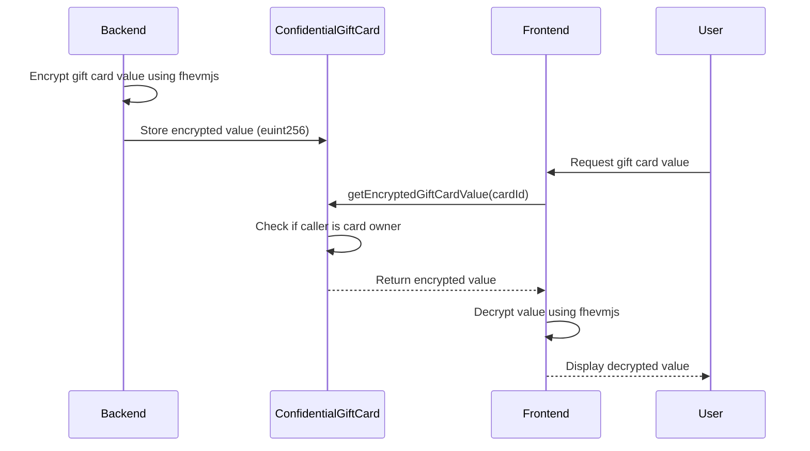
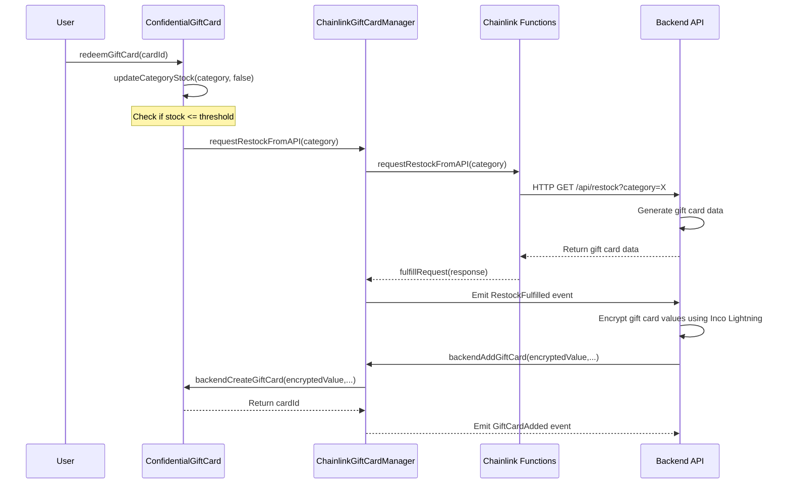

# DG Market

A decentralized gift card marketplace using Inco Lightning's Fully Homomorphic Encryption (FHE) for confidential gift card values and Chainlink Functions for automated gift card restocking.

## Features

- **Privacy-First Design**: Encrypted gift card values using Inco Lightning FHE
- **Multi-Token Support**: Accept payments in various ERC-20 tokens
- **Secure Ownership Transfer**: Confidential gift card transfers
- **Autonomous Restocking**: Automated gift card inventory management via Chainlink Functions
- **Owner-Only Access**: Only gift card owners can view and decrypt their gift card values

## Tech Stack

### Frontend
- Next.js 14, React 18
- Wagmi v2, Viem 2.0
- fhevmjs for client-side decryption
- React Query, Zustand
- Tailwind CSS, Chakra UI

### Backend
- Node.js with Express
- Ethers.js for blockchain interaction
- fhevmjs for gift card value encryption
- Winston for logging
- Axios for API requests

### Smart Contracts
- Solidity 0.8.24
- OpenZeppelin contracts
- Chainlink Functions v1.0.0
- Inco Lightning FHE

## Prerequisites

- Node.js 18+ and pnpm
- MetaMask or another Ethereum wallet browser extension
- Access to Base Sepolia testnet
- Chainlink Functions subscription
- Chainlink DON ID
- Inco Lightning API key

## Getting Started

### Installation

1. Clone the repository:
   ```bash
   git clone https://github.com/yourusername/dgmarket.git
   cd dgmarket
   ```

2. Install dependencies for all components:
   ```bash
   # Install frontend dependencies
   cd frontend
   pnpm install
   cd ..
   
   # Install backend dependencies
   cd backend
   npm install
   cd ..
   
   # Install contract dependencies
   cd contracts
   npm install
   ```

3. Create environment files:

   **Frontend (.env.local in frontend directory):**
   ```
   NEXT_PUBLIC_BASE_SEPOLIA_RPC_URL=https://base-sepolia-rpc.publicnode.com
   NEXT_PUBLIC_ENVIRONMENT=local # Options: local, testnet, mainnet
   NEXT_PUBLIC_INCO_GATEWAY_URL=https://api.inco.org/api/v1
   ```

   **Backend (.env in backend directory):**
   ```
   PORT=3001
   RPC_URL=https://base-sepolia-rpc.publicnode.com
   PRIVATE_KEY=your_backend_wallet_private_key
   CHAINLINK_MANAGER_ADDRESS=your_deployed_contract_address
   CONFIDENTIAL_GIFTCARD_ADDRESS=your_deployed_contract_address
   GIFT_CARD_API_URL=https://api.giftcards.com
   LOG_LEVEL=info
   INCO_GATEWAY_URL=https://api.inco.org/api/v1
   ```

   **Contracts (.env in contracts directory):**
   ```
   PRIVATE_KEY=your_wallet_private_key
   BASE_SEPOLIA_RPC_URL=https://base-sepolia-rpc.publicnode.com
   CHAINLINK_SUBSCRIPTION_ID=your_chainlink_subscription_id
   CHAINLINK_DON_ID=your_chainlink_don_id
   INCO_GATEWAY_URL=https://api.inco.org/api/v1
   ```

## Running the Application

### Frontend

```bash
cd frontend
pnpm dev
```

The frontend will be available at [http://localhost:3000](http://localhost:3000).

### Backend

```bash
cd backend
npm run dev
```

The backend service will start on port 3001 (or as configured in .env).

## Smart Contract Deployment

1. Navigate to the contracts directory:
   ```bash
   cd contracts
   ```

2. Deploy contracts using Hardhat:
   ```bash
   npx hardhat run scripts/deploy.js --network base-sepolia
   ```

3. After deployment, update the contract addresses in:
   - Frontend: `/frontend/constants/addresses.js`
   - Backend: `.env` file

## Project Structure

```
├── frontend/                  # Next.js frontend application
│   ├── app/                   # Next.js app directory
│   ├── components/            # Reusable React components
│   ├── constants/             # Contract ABIs and addresses
│   ├── hooks/                 # Custom React hooks
│   └── utils/                 # Utility functions including incoEncryption.js
│
├── backend/                   # Node.js backend service
│   ├── abis/                  # Contract ABIs for backend
│   ├── controllers/           # API route controllers
│   ├── services/              # Business logic services
│   ├── utils/                 # Utility functions
│   └── index.js               # Main entry point
│
└── contracts/                 # Solidity smart contracts
    ├── contracts/             # Contract source files
    │   ├── ChainlinkGiftCardManager.sol  # Gift card inventory with Chainlink Functions
    │   ├── ConfidentialGiftCard.sol      # FHE-based encrypted gift cards
    │   └── DGMarketCore.sol              # Core marketplace functionality
    ├── scripts/               # Deployment and testing scripts
    └── test/                  # Contract test files
```

## Smart Contract Architecture

### DGMarketCore.sol
- Core marketplace functionality
- Handles listings, purchases, and payments
- Implements AccessControl for role-based permissions
- Manages supported payment tokens

### ConfidentialGiftCard.sol
- ERC721 token representing gift cards
- Stores encrypted gift card values using Inco Lightning FHE
- Handles ownership transfers and redemption requests
- Implements access control for admin and backend roles
- Provides owner-only access to encrypted gift card values

### ChainlinkGiftCardManager.sol
- Manages gift card inventory by category
- Uses Chainlink Functions to request restocking from external APIs
- Implements threshold-based automated restocking
- Tracks inventory levels and pending requests

## Encryption Flow

### Gift Card Value Encryption

1. **Backend Encryption**: Gift card values are encrypted by the backend using Inco Lightning's fhevmjs SDK
2. **On-Chain Storage**: Encrypted values are stored on-chain as `euint256` type
3. **Access Control**: Only gift card owners can access their encrypted values
4. **Frontend Decryption**: The frontend decrypts values client-side using the fhevmjs SDK



## Backend Service

The backend service performs several key functions:

1. **Event Monitoring**: Listens for blockchain events like `RestockRequested` and `RestockFulfilled`
2. **API Integration**: Communicates with external gift card providers
3. **Transaction Submission**: Adds new gift cards to the blockchain when restocking
4. **Encryption**: Encrypts gift card values using Inco Lightning's fhevmjs SDK
5. **Health Monitoring**: Provides endpoints to check system status

### Key Endpoints

- `GET /health`: Check service status
- `POST /restock`: Manually trigger restocking for a category
- `GET /inventory/:category`: Get current inventory for a category

## Frontend Components

### Key Pages

- **Home (`/`)**: Landing page with project information
- **Marketplace (`/marketplace`)**: Browse and purchase gift cards
- **My Cards (`/my-cards`)**: View created and purchased gift cards
- **Create (`/create`)**: Create new gift cards
- **Admin (`/admin`)**: Admin dashboard for inventory management

### Admin Dashboard

The admin dashboard includes:

- Gift card inventory management
- Role-based access control
- Restock request management
- Threshold configuration

## Autonomous Stock Refilling System

1. **Inventory Monitoring**: The ConfidentialGiftCard contract tracks inventory levels by category
2. **Threshold Detection**: When inventory falls below a preset threshold, a restock request is triggered
3. **Chainlink Functions**: The request is processed by Chainlink Functions, which calls the backend API
4. **Backend Processing**: The backend generates new gift card data and encrypts values using Inco Lightning
5. **Card Creation**: Encrypted gift cards are added to the blockchain through the backend role



## Development Guidelines

- Use React hooks for state management
- Follow the container/presentational component pattern
- Use Wagmi hooks for blockchain interactions
- Implement proper error handling for all blockchain operations
- Keep sensitive operations client-side with encryption
- Ensure only gift card owners can access and decrypt their gift card values

## Contributing

1. Fork the repository
2. Create a feature branch: `git checkout -b feature/my-feature`
3. Commit changes: `git commit -m 'Add my feature'`
4. Push to branch: `git push origin feature/my-feature`
5. Submit a pull request

## License

This project is licensed under the MIT License - see the LICENSE file for details.
