# DGMarket

**DGMarket** is a revolutionary decentralized gift card marketplace that combines privacy, automation, and seamless payment experiences. Built on Base Sepolia, DGMarket uses Inco Lightning's Fully Homomorphic Encryption (FHE) to keep gift card codes completely private while enabling automated inventory management through Chainlink Functions.

## 🎯 How DGMarket Works

### **Privacy-First Design**
When gift cards are created, their codes and PINs are encrypted using Inco Lightning's FHE technology. Only the rightful owner can decrypt and view their gift card details, ensuring complete privacy and security.

### **Seamless ETH-to-Gift Card Flow**
Users can purchase gift cards using ETH through an integrated **OKX DEX API**. The system automatically:
- ✅ Accepts ETH payments on Base Mainnet
- ✅ Swaps ETH to USDC via OKX DEX at market rates
- ✅ Processes cross-chain events to Base Sepolia
- ✅ Automatically delivers encrypted gift cards to users' wallets

### **Autonomous Inventory Management**
The platform features intelligent restocking through Chainlink Functions. When inventory runs low, the system automatically calls external APIs to replenish gift card stock, ensuring continuous availability across categories like Gaming, Food & Dining, Travel, and Entertainment.

## ⚡ Ecosystem Benefits

- **One-Click Purchases**: Users simply send ETH - no need to manually swap tokens or navigate complex DeFi protocols
- **Complete Privacy**: Gift card codes remain encrypted on-chain until revealed by the owner
- **Always Available**: Automated restocking ensures gift cards are always in stock
- **Multi-Category Support**: From gaming credits to travel vouchers, diverse gift card categories for every need
- **Cross-Chain Efficiency**: Optimized for Base ecosystem with seamless mainnet-to-testnet bridging

## 🏗️ Architecture Overview

DGMarket uses a **simplified 2-contract architecture** for optimal efficiency:

1. **DGMarketCore.sol** - Core contract (FHE + Marketplace + Inventory + State-based ownership)
2. **ChainlinkGiftCardManager.sol** - Automation-only contract for restocking

## 📍 **DEPLOYED CONTRACT ADDRESSES - LATEST**

### **Base Mainnet (8453) - Cross-Chain Bridge:**
- **SimpleBridge**: `0xF7cF8159C710eb23b81b9EA1EbA5Db91Dd0dd4Ba`

### **Base Sepolia (84532) - Gift Card Contracts:**
- **DGMarketCore**: `0x48877c01E8FD5c29d1C7039b343c4129a6733E86`
- **ChainlinkGiftCardManager**: `0xAEC4cC181d3E14c6626aa6E189A16E6Be9766D75`

## 🚀 Tech Stack

### **Smart Contracts**
- Solidity 0.8.24 with OpenZeppelin contracts
- Inco Lightning FHE for encryption
- Chainlink Functions v1.0.0 for automation
- Base Sepolia testnet deployment

### **Backend**
- Node.js with Express
- Inco Lightning SDK for encryption
- OKX DEX API integration
- Ethers.js for blockchain interaction
- Winston logging and comprehensive error handling

### **Frontend**
- Next.js 13.5 with React 18
- Wagmi v2 and Viem v2 for Web3 integration
- Inco Lightning SDK for client-side decryption
- Radix UI and shadcn/ui components
- Zustand for state management

## 🛠️ Prerequisites

- Node.js 18+ and pnpm
- MetaMask or another Ethereum wallet
- Access to Base Sepolia testnet
- Chainlink Functions subscription
- OKX API credentials for DEX integration

## 📦 Installation

### 1. Clone Repository
```bash
git clone https://github.com/azhar0406/dgmarket.git
cd dgmarket
```

### 2. Install Dependencies
```bash
# Frontend dependencies
cd frontend && pnpm install && cd ..

# Backend dependencies  
cd backend && npm install && cd ..

# Contract dependencies
cd contracts && npm install && cd ..
```

### 3. Environment Configuration

**Frontend (.env.local):**
```env
NEXT_PUBLIC_BASE_SEPOLIA_RPC_URL=https://base-sepolia-rpc.publicnode.com
NEXT_PUBLIC_DGMARKET_CORE_ADDRESS=0x48877c01E8FD5c29d1C7039b343c4129a6733E86
NEXT_PUBLIC_CHAINLINK_MANAGER_ADDRESS=0xAEC4cC181d3E14c6626aa6E189A16E6Be9766D75
NEXT_PUBLIC_SIMPLE_BRIDGE_ADDRESS=0xF7cF8159C710eb23b81b9EA1EbA5Db91Dd0dd4Ba
NEXT_PUBLIC_INCO_GATEWAY_URL=https://api.inco.org/api/v1
NEXT_PUBLIC_ENVIRONMENT=testnet
```

**Backend (.env):**
```env
PORT=8082
BASE_SEPOLIA_RPC_URL=https://base-sepolia-rpc.publicnode.com
BASE_MAINNET_RPC_URL=https://base.llamarpc.com
PRIVATE_KEY_BASE_SEPOLIA=your_private_key
DGMARKET_CORE_SEPOLIA=0x48877c01E8FD5c29d1C7039b343c4129a6733E86
CHAINLINK_MANAGER_ADDRESS=0xAEC4cC181d3E14c6626aa6E189A16E6Be9766D75

# OKX DEX API Configuration
OKX_API_KEY=your_okx_api_key
OKX_SECRET_KEY=your_okx_secret_key
OKX_API_PASSPHRASE=your_okx_passphrase
OKX_PROJECT_ID=your_okx_project_id

# Payment Processor
SIMPLE_BRIDGE_MAINNET=0xF7cF8159C710eb23b81b9EA1EbA5Db91Dd0dd4Ba
ADMIN_ADDRESS=your_admin_address
ADMIN_PRIVATE_KEY=your_admin_private_key
```

**Contracts (.env):**
```env
PRIVATE_KEY_BASE_SEPOLIA=your_wallet_private_key
BASE_SEPOLIA_RPC_URL=https://base-sepolia-rpc.publicnode.com
BASE_MAINNET_RPC_URL=https://base.llamarpc.com
CHAINLINK_SUBSCRIPTION_ID=your_chainlink_subscription_id
CHAINLINK_DON_ID=0x66756e2d626173652d7365706f6c69612d310000000000000000000000000000
CHAINLINK_FUNCTIONS_ROUTER=0xf9B8fc078197181C841c296C876945aaa425B278
ETHERSCAN_API_KEY=your_etherscan_api_key
```

## 🚀 Quick Start

### 1. Deploy Smart Contracts
```bash
cd contracts
pnpm hardhat ignition deploy ./ignition/modules/DGMarketComplete.ts --network baseSepolia
node scripts/complete-master-setup.js
```

### 2. Start Backend Services
```bash
# Gift card backend (port 8082)
cd backend && npm start

# Payment processor (port 3001)  
cd backend && node payment-processor.js
```

### 3. Launch Frontend
```bash
cd frontend && pnpm dev
```

Visit [http://localhost:3000](http://localhost:3000) to access DGMarket!

## 🏛️ Smart Contract Architecture

### **SimpleBridge.sol - Cross-Chain Connector**
- **Address**: `0xF7cF8159C710eb23b81b9EA1EbA5Db91Dd0dd4Ba` (Base Mainnet)
- **Verification**: [https://basescan.org/address/0xF7cF8159C710eb23b81b9EA1EbA5Db91Dd0dd4Ba](https://basescan.org/address/0xF7cF8159C710eb23b81b9EA1EbA5Db91Dd0dd4Ba)
- **Cross-Chain Events**: Facilitates ETH-to-gift card flow
- **OKX Integration**: Supports automated payment processing
- **Event Emission**: Triggers gift card purchases from mainnet

### **DGMarketCore.sol - The Heart of DGMarket**
- **Address**: `0x48877c01E8FD5c29d1C7039b343c4129a6733E86`
- **Verification**: [https://sepolia.basescan.org/address/0x48877c01E8FD5c29d1C7039b343c4129a6733E86](https://sepolia.basescan.org/address/0x48877c01E8FD5c29d1C7039b343c4129a6733E86)
- **FHE Integration**: Encrypted gift card codes and PINs using Inco Lightning
- **State-Based Ownership**: Clean address-based ownership tracking
- **Public Pricing**: Prices visible for marketplace browsing
- **Inventory Management**: Category-based tracking with auto-restock triggers
- **Resale Protection**: Prevents resale of revealed gift cards

### **ChainlinkGiftCardManager.sol - Automation Engine**
- **Address**: `0xAEC4cC181d3E14c6626aa6E189A16E6Be9766D75`
- **Verification**: [https://sepolia.basescan.org/address/0xAEC4cC181d3E14c6626aa6E189A16E6Be9766D75](https://sepolia.basescan.org/address/0xAEC4cC181d3E14c6626aa6E189A16E6Be9766D75)
- **Chainlink Functions**: Automated API calls for restocking
- **Request Management**: Tracks pending/fulfilled restock operations
- **Error Handling**: Comprehensive API failure management
- **Category Monitoring**: Batch checking across all categories

## 💰 Payment Flow with OKX DEX

```mermaid
sequenceDiagram
    participant User
    participant Frontend
    participant PaymentProcessor
    participant OKXDex
    participant Bridge
    participant DGMarketCore
    
    User->>Frontend: Send ETH to purchase gift card
    Frontend->>PaymentProcessor: Process ETH payment
    PaymentProcessor->>OKXDex: Swap ETH → USDC at market rate
    OKXDex-->>PaymentProcessor: Return USDC
    PaymentProcessor->>Bridge: Emit cross-chain event
    Bridge->>DGMarketCore: Purchase gift card on behalf of user
    DGMarketCore->>DGMarketCore: Transfer encrypted gift card to user
    DGMarketCore-->>User: Gift card delivered to wallet
```



## 🔐 Privacy & Security Features

### **Fully Homomorphic Encryption**
- Gift card codes and PINs encrypted using Inco Lightning
- Only card owners can decrypt their gift card details
- All sensitive data remains encrypted on-chain

### **Smart Contract Security**
- Role-based access control (ADMIN_ROLE, AUTOMATION_ROLE)
- Resale restrictions after gift card revelation
- Comprehensive input validation and error handling

### **Payment Security**
- Cross-chain event verification
- Automated gas management with dynamic pricing
- Concurrent request protection

## 🎮 Available Categories

- **🎮 Gaming**: Google Play, League of Legends, Teamfight Tactics
- **🍔 Food & Dining**: KFC, McDonald's, Zomato
- **🛍️ Shopping**: Amazon Prime, Universal Vouchers, Premium Cards
- **✈️ Travel**: Air India, Uber Rides
- **🎬 Entertainment**: Premium subscriptions and access cards

## 🔄 Automated Restocking System

1. **Inventory Monitoring**: DGMarketCore tracks stock levels by category
2. **Threshold Detection**: Auto-triggers when inventory falls below threshold
3. **Chainlink Functions**: Calls external APIs for new gift card data
4. **Backend Processing**: Creates encrypted gift cards with proper Inco encryption
5. **Seamless Delivery**: New cards automatically added to marketplace

## 🧪 Testing

```bash
# Test smart contracts
cd contracts && pnpm hardhat test --network baseSepolia

# Test backend APIs
cd backend && npm test


```

## 🔗 Verification Links

### **Base Mainnet:**
- **SimpleBridge**: https://basescan.org/address/0xF7cF8159C710eb23b81b9EA1EbA5Db91Dd0dd4Ba

### **Base Sepolia (Testnet):**
- **DGMarketCore**: https://sepolia.basescan.org/address/0x48877c01E8FD5c29d1C7039b343c4129a6733E86
- **ChainlinkGiftCardManager**: https://sepolia.basescan.org/address/0xAEC4cC181d3E14c6626aa6E189A16E6Be9766D75

## 📁 Project Structure

```
dgmarket/
├── frontend/                 # Next.js application
│   ├── app/                  # App directory with pages
│   ├── components/           # Reusable React components
│   ├── hooks/                # Custom React hooks
│   └── utils/                # Utility functions
├── backend/                  # Node.js backend services
│   ├── admin/                # Admin management tools
│   │   └── payment-processor.js  # OKX DEX integration
│   └── index.js              # Main API server
└── contracts/                # Smart contracts
    ├── contracts/            # Solidity source files
    ├── scripts/              # Deployment scripts
    └── test/                 # Contract tests
```

## 🤝 Contributing

1. Fork the repository
2. Create a feature branch: `git checkout -b feature/amazing-feature`
3. Commit changes: `git commit -m 'Add amazing feature'`
4. Push to branch: `git push origin feature/amazing-feature`
5. Open a Pull Request

## 📜 License

This project is licensed under the MIT License - see the [LICENSE](LICENSE) file for details.

## 🔗 Links

- **GitHub**: [https://github.com/azhar0406/dgmarket](https://github.com/azhar0406/dgmarket)
- **Base Sepolia Explorer**: [https://sepolia.basescan.org](https://sepolia.basescan.org)
- **Base Mainnet Explorer**: [https://basescan.org](https://basescan.org)
- **Inco Lightning**: [https://docs.inco.org](https://docs.inco.org)
- **Chainlink Functions**: [https://functions.chain.link](https://functions.chain.link)

---

**DGMarket eliminates the complexity of traditional gift card platforms by combining FHE privacy, automated operations, and user-friendly ETH payments. Users get instant access to encrypted gift cards while the platform maintains itself through intelligent automation, creating a truly decentralized and sustainable marketplace experience.** 🎯