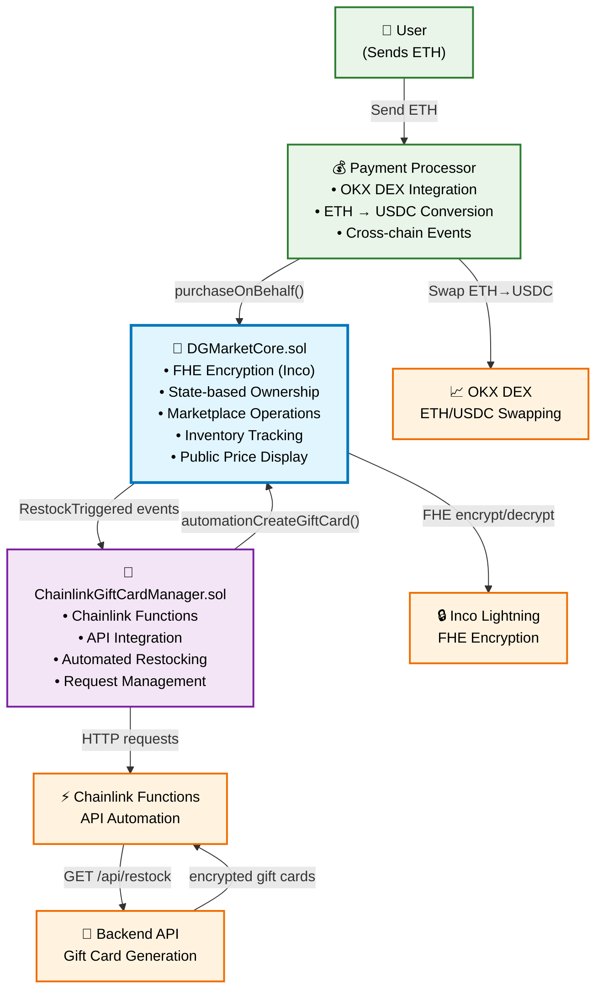
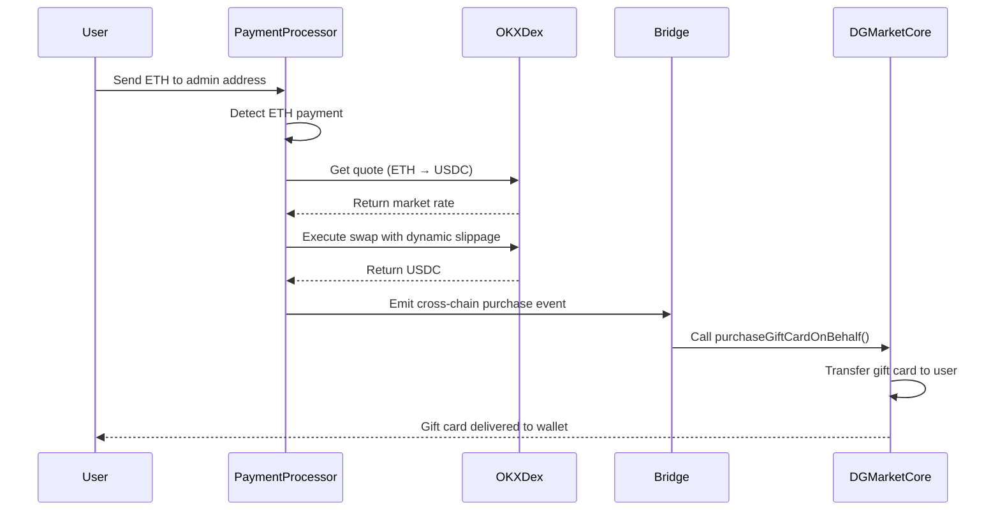
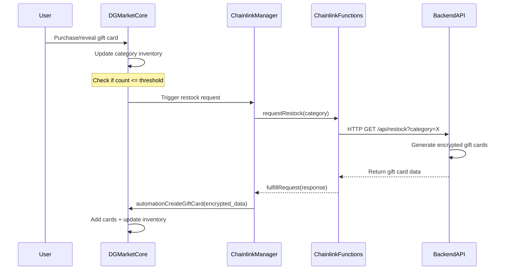

# **DGMarket - Smart Contract System**

This repository provides a **complete Hardhat setup** for developing and testing **encrypted gift cards** using **Inco Lightning's Fully Homomorphic Encryption (FHE)**, **Chainlink Functions** for automated restocking, and **OKX DEX integration** for seamless ETH-to-gift card purchases.

## **🎯 What Makes DGMarket Special**

**DGMarket** revolutionizes gift card marketplaces by combining:
- **🔐 Complete Privacy**: Gift card codes encrypted with Inco Lightning FHE
- **⚡ One-Click Purchases**: ETH payments automatically converted via OKX DEX
- **🤖 Smart Automation**: Chainlink Functions ensure gift cards are always in stock
- **🌐 Cross-Chain Magic**: Seamless Base Mainnet → Base Sepolia experience

Users simply send ETH and receive encrypted gift cards - no manual token swaps, no complex DeFi navigation required!

## **🏗️ Architecture Overview**

DGMarket uses a **simplified 2-contract architecture** optimized for privacy and automation:



## **📋 Smart Contracts**

### **🎯 DGMarketCore.sol - The Heart of Privacy**

**Core Features:**
- **🔐 FHE Integration**: Gift card codes/PINs encrypted using Inco Lightning
- **📊 State-Based Ownership**: Clean `mapping(address => uint256[])` tracking
- **💰 Public Pricing**: Prices visible for marketplace browsing (not encrypted)
- **🛡️ Resale Protection**: Prevents resale of revealed gift cards
- **🏪 Inventory Management**: Category-based tracking with auto-restock triggers
- **👑 Admin Controls**: Role-based access (ADMIN_ROLE, AUTOMATION_ROLE)

**Key Functions:**
```solidity
// Create encrypted gift cards (Admin/Automation)
function adminCreateGiftCard(
    bytes encryptedCodeInput, 
    bytes encryptedPinInput,    // 🔒 FHE encrypted PIN
    uint256 publicPrice,        // 💰 Public price (NOT encrypted)
    string description, 
    string category, 
    string imageUrl, 
    uint256 expiryDate
) external onlyRole(ADMIN_ROLE);

// Purchase gift cards on behalf of users (Payment Processor)
function purchaseGiftCardOnBehalf(address user, uint256 cardId) external;

// Reveal gift cards (returns encrypted code + PIN)
function revealGiftCard(uint256 cardId) 
    external returns (euint256 encryptedCode, euint256 encryptedPin);

// Frontend browsing functions
function getAllGiftCards() external view returns (GiftCardPublicData[] memory);
function getMyGiftCards() external view returns (GiftCardPublicData[] memory);
function getGiftCardsByCategory(string memory category) external view returns (GiftCardPublicData[] memory);
```

**Gift Card Structure:**
```solidity
struct GiftCard {
    uint256 cardId;             // Sequential unique ID
    euint256 encryptedCode;     // 🔒 FHE encrypted voucher code
    euint256 encryptedPin;      // 🔒 FHE encrypted security PIN
    uint256 publicPrice;        // 💰 Public price for browsing
    address owner;              // Current owner
    address creator;            // Original creator
    string category;            // "Gaming", "Food & Dining", etc.
    string description;         // Public description
    string imageUrl;            // IPFS image URL
    bool isRevealed;            // Prevents resale after reveal
    uint256 createdAt;          // Creation timestamp
}
```

### **🤖 ChainlinkGiftCardManager.sol - Automation Engine**

**Core Features:**
- **⚡ Chainlink Functions**: Automated API calls for restocking
- **📋 Request Management**: Tracks pending/fulfilled restock requests  
- **🎯 No Inventory Storage**: All inventory managed by DGMarketCore
- **📊 Category Monitoring**: Batch checking and triggering
- **🛠️ Error Handling**: Comprehensive API failure management

**Key Functions:**
```solidity
// Monitor and trigger restocking
function checkAndTriggerRestock(string calldata category) external returns (bool wasTriggered);

// Request restocking via Chainlink Functions
function requestRestock(string calldata category) external returns (bytes32 requestId);

// Process API responses and create gift cards
function parseAndCreateGiftCards(string calldata category, bytes calldata response) external;
```

## **💰 OKX DEX Payment Integration**

### **Payment Flow Architecture:**



### **Payment Processor Features:**
- **🔄 Dynamic Gas Management**: Automatic gas price optimization
- **🎯 Market Rate Swapping**: Real-time ETH/USDC conversion
- **🛡️ Slippage Protection**: Automatic adjustment (1% → 3%)
- **🌉 Cross-Chain Events**: Seamless Base Mainnet → Sepolia
- **⚡ Concurrent Protection**: Prevents duplicate processing

## **🛠️ Setup Instructions**

### **1. Clone & Install**
```bash
git clone <your-repo-url>
cd dgmarket/contracts
pnpm install
```

### **2. Environment Configuration**

Create `.env` file with your configuration:

```plaintext
# 🔗 Blockchain Configuration
PRIVATE_KEY_BASE_SEPOLIA=your_private_key_here
BASE_SEPOLIA_RPC_URL=https://base-sepolia-rpc.publicnode.com
BASE_MAINNET_RPC_URL=https://base.llamarpc.com

# ⚡ Chainlink Functions (Base Sepolia)
CHAINLINK_FUNCTIONS_ROUTER=0xf9B8fc078197181C841c296C876945aaa425B278
CHAINLINK_DON_ID=0x66756e2d626173652d7365706f6c69612d310000000000000000000000000000
CHAINLINK_SUBSCRIPTION_ID=416

# 🔍 Verification
ETHERSCAN_API_KEY=your_etherscan_api_key

# 🎮 API Configuration
GIFT_CARD_API_URL=http://localhost:8082

# 🔒 Inco Lightning
INCO_GATEWAY_URL=https://api.inco.org/api/v1

# 💰 OKX DEX API (for payment processor)
OKX_API_KEY=your_okx_api_key
OKX_SECRET_KEY=your_okx_secret_key
OKX_API_PASSPHRASE=your_okx_passphrase
OKX_PROJECT_ID=your_okx_project_id

# 🌉 Cross-Chain Bridge
SIMPLE_BRIDGE_MAINNET=your_bridge_contract_address
ADMIN_ADDRESS=your_admin_wallet_address
ADMIN_PRIVATE_KEY=your_admin_private_key
```

### **3. Compile Smart Contracts**
```bash
pnpm hardhat compile
```

### **4. Deploy Complete System**

```bash
# 🚀 Deploy contracts
pnpm hardhat ignition deploy ./ignition/modules/DGMarketComplete.ts --network baseSepolia --reset
```

### **5. Configure the Contracts**

After deployment, run the **one-click setup script**:

```bash
node scripts/complete-master-setup.js
```

This automatically handles:
- ✅ Role configuration and permissions
- ✅ Chainlink subscription setup  
- ✅ Contract verification on BaseScan
- ✅ Environment file updates
- ✅ Category and token configuration

### **6. Run Tests**

```bash
pnpm hardhat test test/AdminGiftCard.test.js --network baseSepolia
```

### **7. Sync Frontend ABIs**

```bash
node scripts/sync-frontend-abis.js
```

### **8. Start Frontend**

```bash
cd .. && cd frontend && pnpm run dev
```

### **4. Test Deployment**

```bash
# 🧪 Test gift card creation
pnpm hardhat test test/AdminGiftCard.test.js --network baseSepolia

# 🔄 Test Chainlink integration
curl "http://localhost:8082/api/restock?category=Travel"

# 💰 Test payment processor
node scripts/test-payment-flow.js

# 📦 Ensure frontend has latest ABIs
node scripts/sync-frontend-abis.js
```

## **📁 Project Structure**

```
contracts/
├── contracts/
│   ├── DGMarketCore.sol                    # 🎯 Main core contract with FHE
│   ├── ChainlinkGiftCardManager.sol        # 🤖 Automation contract
│   └── SimpleBridge.sol                    # 🌉 Cross-chain bridge
├── ignition/modules/
│   ├── DGMarketComplete.ts                 # 🚀 Complete deployment
│   └── SimpleBridge.ts                     # 🌉 Bridge deployment
├── scripts/
│   ├── complete-master-setup.js            # ⚙️ One-click configuration
│   ├── sync-frontend-abis.js               # 📦 ABI synchronization
│   └── test-payment-flow.js                # 💰 Payment testing
├── test/
│   ├── AdminGiftCard.test.js               # 🧪 Core functionality tests
│   └── ChainlinkIntegration.test.js        # ⚡ Automation tests
└── backend/
    ├── index.js                            # 🔄 Gift card API server
    ├── payment-processor.js                # 💰 OKX DEX integration
    └── admin/                              # 👑 Admin management tools
```

## **🔐 Security & Privacy Features**

### **Inco Lightning FHE Integration**
```solidity
// 🔒 Fully Homomorphic Encryption
import {euint256, ebool, TFHE} from "@inco/lightning/src/Lib.sol";

// Encrypt gift card codes and PINs
euint256 encryptedCode = TFHE.asEuint256(encryptedCodeInput);
euint256 encryptedPin = TFHE.asEuint256(encryptedPinInput);

// Only owner can decrypt
function revealGiftCard(uint256 cardId) external returns (euint256, euint256) {
    require(giftCards[cardId].owner == msg.sender, "Not card owner");
    require(!isRevealed[cardId], "Card already revealed");
    
    isRevealed[cardId] = true; // Prevent resale
    return (giftCards[cardId].encryptedCode, giftCards[cardId].encryptedPin);
}
```

### **Role-Based Access Control**
```solidity
// 👑 Admin-only gift card creation
function adminCreateGiftCard(...) external onlyRole(ADMIN_ROLE) {
    categoryInventory[category].count++; // Update inventory
}

// 🤖 Automation-only creation
function automationCreateGiftCard(...) external onlyRole(AUTOMATION_ROLE) {
    categoryInventory[category].count++; // Update inventory
}
```

### **Resale Protection**
```solidity
// 🛡️ Prevent resale of revealed cards
mapping(uint256 => bool) public isRevealed;

function listGiftCard(uint256 cardId, address paymentToken, uint256 price) external {
    require(!isRevealed[cardId], "CardAlreadyRevealed");
    // Create listing...
}
```

## **🎮 Available Gift Card Categories**

The system supports diverse categories with automated restocking:

- **🎮 Gaming**: Google Play, League of Legends, Teamfight Tactics, Legends of Runeterra
- **🍔 Food & Dining**: KFC, McDonald's, Zomato
- **🛍️ Shopping**: Amazon Prime, Universal Vouchers, Premium Gift Cards
- **✈️ Travel**: Air India, Uber Rides
- **🎬 Entertainment**: Premium subscriptions, access cards, promotional offers

## **🔄 Automated Restocking System**



## **🧪 Testing Framework**

### **Smart Contract Tests**
```bash
# Test core functionality
pnpm hardhat test test/AdminGiftCard.test.js --network baseSepolia

# Test with coverage
pnpm hardhat coverage

# Test specific functions
pnpm hardhat test --grep "should create gift card with PIN encryption"
```

### **Integration Tests**
```bash
# Test complete payment flow
node scripts/test-payment-flow.js

# Test Chainlink integration
node scripts/test-chainlink-functions.js

# Test OKX DEX integration
node scripts/test-okx-integration.js
```

## **⚡ Frontend Integration**

### **Simplified View Functions**
```javascript
// 🏪 Browse marketplace
const allCards = await dgMarketContract.read.getAllGiftCards();

// 🎯 Filter by category
const gamingCards = await dgMarketContract.read.getGiftCardsByCategory(["Gaming"]);

// 👤 User dashboard
const myCards = await dgMarketContract.read.getMyGiftCards();

// 🔓 Reveal gift card (owner only)
const [encryptedCode, encryptedPin] = await dgMarketContract.write.revealGiftCard([cardId]);
const decryptedCode = await incoSDK.decrypt(encryptedCode);
const decryptedPin = await incoSDK.decrypt(encryptedPin);
```

### **Payment Integration**
```javascript
// 💰 Simple ETH payment (OKX handles conversion)
const paymentProcessor = new PaymentProcessor(config);
const result = await paymentProcessor.processTransactionHash(txHash, cardId, userAddress);

// User just sends ETH - system handles the rest!
```

## **🔧 Development Commands**

```bash
# 📦 Compile contracts
pnpm hardhat compile

# 🚀 Deploy system
pnpm hardhat ignition deploy ./ignition/modules/DGMarketComplete.ts --network baseSepolia

# ⚙️ Setup system
node scripts/complete-master-setup.js

# 🔄 Sync ABIs
node scripts/sync-frontend-abis.js

# 🧪 Run tests
pnpm hardhat test --network baseSepolia

# 🔍 Verify contracts
pnpm hardhat verify DEPLOYED_CONTRACT_ADDRESS --network baseSepolia
```

## **📈 Key Achievements**

- ✅ **Complete Privacy**: Gift card codes fully encrypted with FHE
- ✅ **Seamless Payments**: ETH → Gift cards via OKX DEX integration  
- ✅ **Auto-Restocking**: Chainlink Functions ensure constant availability
- ✅ **Cross-Chain**: Smooth Base Mainnet → Sepolia experience
- ✅ **Gas Optimized**: Dynamic gas management and slippage protection
- ✅ **Production Ready**: Comprehensive testing and error handling

## **🤝 Contributing**

1. Fork the repository
2. Create feature branch: `git checkout -b feature/amazing-feature`
3. Commit changes: `git commit -m 'Add amazing feature'`
4. Push to branch: `git push origin feature/amazing-feature`
5. Open Pull Request

## **📞 Support**

- **GitHub Issues**: Report bugs and feature requests
- **Documentation**: Check `/docs` for detailed guides
- **Base Sepolia Explorer**: [https://sepolia.basescan.org](https://sepolia.basescan.org)

---

**🎯 DGMarket Smart Contracts: Where privacy meets automation in the gift card marketplace revolution!**