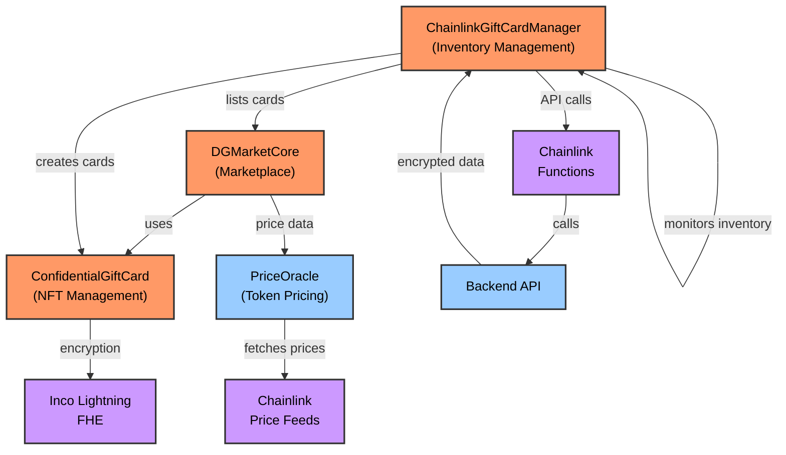
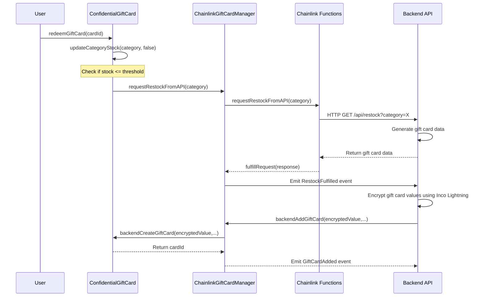
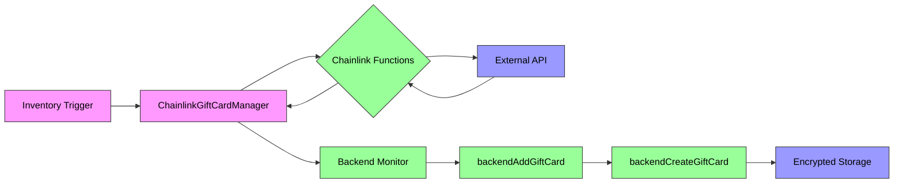
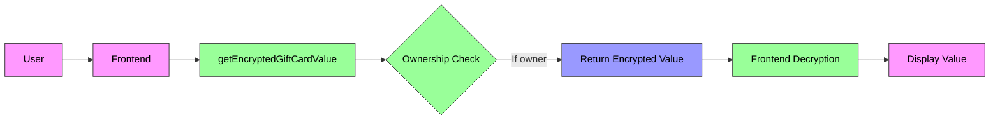

# **DGMarket - Smart Contract System**

This repository provides a **complete Hardhat setup** for developing and testing **encrypted gift cards** using **Inco Lightning's Fully Homomorphic Encryption (FHE)** and **Chainlink Functions** for automated restocking.

## **Setup Instructions**

### **1. Clone the Repository**
```sh
git clone <your-repo-url>
cd into_your_repo
```

### **2. Install Dependencies**
```sh
pnpm install
```

### **3. Configure Environment Variables**  

Fill in your own information in the `.env` file, you can take this as example:

```plaintext
# This should be a private key funded with native tokens.
PRIVATE_KEY_ANVIL="0xac0974bec39a17e36ba4a6b4d238ff944bacb478cbed5efcae784d7bf4f2ff80"
PRIVATE_KEY_BASE_SEPOLIA=""

# This should be a seed phrase used to test functionalities with different accounts.  
# You can send funds from the main wallet to this whenever needed.
SEED_PHRASE="garden cage click scene crystal fat message twice rubber club choice cool"

# This should be an RPC URL provided by a proper provider  
# that supports the eth_getLogs() and eth_getFilteredLogs() methods.
LOCAL_CHAIN_RPC_URL="http://localhost:8545"
BASE_SEPOLIA_RPC_URL="https://base-sepolia-rpc.publicnode.com"

# Chainlink Functions Configuration
CHAINLINK_DON_ID="functions_don_id_here"
CHAINLINK_SUBSCRIPTION_ID="subscription_id_here"
CHAINLINK_FUNCTIONS_ROUTER="0x0000000000000000000000000000000000000000"

# Inco Lightning Configuration
INCO_GATEWAY_URL="https://api.inco.org/api/v1"
```

### **4. Compile Smart Contracts**
```sh
pnpm hardhat compile
```

### **5. Deploy Contracts**

To deploy the complete DGMarket system:

```sh
pnpm hardhat ignition deploy ./ignition/modules/DGMarketComplete.ts --network baseSepolia
```

### **6. Configure the Contracts**

After deployment, run the configuration script to set up the contracts:

```sh
node scripts/configure-viem.js
```

### **7. Run Tests**
```sh
pnpm hardhat test --network anvil
```

Or, if running against another network, e.g. Base Sepolia, run

```sh
pnpm hardhat test --network baseSepolia
```

## **DGMarket Smart Contract System**

## Contract Architecture

The following diagram illustrates the relationships between the smart contracts in the DGMarket system:


```mermaid
flowchart TD
    classDef mainContract fill:#f96,stroke:#333,stroke-width:2px,color:#000
    classDef utilityContract fill:#9cf,stroke:#333,stroke-width:2px,color:#000
    classDef externalContract fill:#c9f,stroke:#333,stroke-width:2px,color:#000
    classDef chainlinkContract fill:#9fc,stroke:#333,stroke-width:2px,color:#000

    DGMarketCore["DGMarketCore\n(Marketplace)"] --> |uses| ConfidentialGiftCard["ConfidentialGiftCard\n(NFT Management)"];
    DGMarketCore --> |price data| PriceOracle["PriceOracle\n(Token Pricing)"];
    
    ChainlinkGiftCardManager["ChainlinkGiftCardManager\n(Inventory Management)"] --> |creates cards| ConfidentialGiftCard;
    ChainlinkGiftCardManager --> |lists cards| DGMarketCore;
    ChainlinkGiftCardManager --> |monitors inventory| ChainlinkGiftCardManager;
    
    PriceOracle --> |fetches prices| ChainlinkPriceFeed["Chainlink\nPrice Feeds"];
    ChainlinkGiftCardManager --> |API calls| ChainlinkFunctions["Chainlink\nFunctions"];
    ChainlinkFunctions --> |calls| BackendAPI["Backend API"];
    BackendAPI --> |encrypted data| ChainlinkGiftCardManager;
    
    ConfidentialGiftCard --> |encryption| IncoLightning["Inco Lightning\nFHE"];
    
    DGMarketCore:::mainContract
    ConfidentialGiftCard:::mainContract
    ChainlinkGiftCardManager:::mainContract
    PriceOracle:::utilityContract
    ChainlinkPriceFeed:::externalContract
    ChainlinkFunctions:::externalContract
    IncoLightning:::externalContract
    BackendAPI:::utilityContract
```

## Key Components

- **DGMarketCore**: The main marketplace contract for buying and selling gift cards
- **ConfidentialGiftCard**: Manages encrypted gift card data using Inco Lightning's FHE technology
- **ChainlinkGiftCardManager**: Handles inventory management and automatic restocking
- **PriceOracle**: Provides token price data for multi-token payments

## Autonomous Stock Refilling System

The DGMarket system features a fully autonomous stock refilling mechanism that works as follows:

1. **Inventory Monitoring**: The ConfidentialGiftCard contract tracks inventory levels by category
2. **Threshold Detection**: When inventory falls below a preset threshold, a restock request is triggered
3. **Chainlink Functions**: The request is processed by Chainlink Functions, which calls the backend API
4. **Backend Processing**: The backend generates new gift card data and encrypts values using Inco Lightning
5. **Card Creation**: Encrypted gift cards are added to the blockchain through the backend role

Benefits of this approach:
- Fully automated inventory management
- No manual intervention is required for restocking
- All sensitive data remains encrypted throughout the process
- The system can scale to handle high transaction volumes

### **Refilling Flow Diagram**


```mermaid
sequenceDiagram
    participant User
    participant ConfidentialGC as ConfidentialGiftCard
    participant ChainlinkManager as ChainlinkGiftCardManager
    participant Chainlink as Chainlink Functions
    participant Backend as Backend API
    
    User->>ConfidentialGC: redeemGiftCard(cardId)
    ConfidentialGC->>ConfidentialGC: updateCategoryStock(category, false)
    Note over ConfidentialGC: Check if stock <= threshold
    ConfidentialGC->>ChainlinkManager: requestRestockFromAPI(category)
    ChainlinkManager->>Chainlink: requestRestockFromAPI(category)
    Chainlink->>Backend: HTTP GET /api/restock?category=X
    Backend->>Backend: Generate gift card data
    Backend-->>Chainlink: Return gift card data
    Chainlink-->>ChainlinkManager: fulfillRequest(response)
    ChainlinkManager->>Backend: Emit RestockFulfilled event
    Backend->>Backend: Encrypt gift card values using Inco Lightning
    Backend->>ChainlinkManager: backendAddGiftCard(encryptedValue,...)
    ChainlinkManager->>ConfidentialGC: backendCreateGiftCard(encryptedValue,...)
    ConfidentialGC-->>ChainlinkManager: Return cardId
    ChainlinkManager-->>Backend: Emit GiftCardAdded event
```

## **Security Architecture**

### **Secure Gift Card Creation Flow**


```mermaid
flowchart LR
    classDef process fill:#f9f,stroke:#333,stroke-width:1px,color:#000
    classDef security fill:#9f9,stroke:#333,stroke-width:1px,color:#000
    classDef data fill:#99f,stroke:#333,stroke-width:1px,color:#000
    
    A[Inventory Trigger]:::process --> B[ChainlinkGiftCardManager]:::process
    B --> C{Chainlink Functions}:::security
    C --> D[External API]:::data
    D --> C
    C --> B
    B --> E[Backend Monitor]:::security
    E --> F[backendAddGiftCard]:::security
    F --> G[backendCreateGiftCard]:::security
    G --> H[Encrypted Storage]:::data
```

### **Secure Gift Card Value Access Flow**


```mermaid
flowchart LR
    classDef process fill:#f9f,stroke:#333,stroke-width:1px,color:#000
    classDef security fill:#9f9,stroke:#333,stroke-width:1px,color:#000
    classDef data fill:#99f,stroke:#333,stroke-width:1px,color:#000
    
    A[User]:::process --> B[Frontend]:::process
    B --> C[getEncryptedGiftCardValue]:::security
    C --> D{Ownership Check}:::security
    D -->|If owner| E[Return Encrypted Value]:::data
    E --> F[Frontend Decryption]:::security
    F --> G[Display Value]:::process
```

1. **Inventory triggers restock** → ConfidentialGiftCard detects low inventory
2. **Chainlink Functions API call** → External API provides gift card data
3. **Backend monitors events** → Listens for RestockFulfilled events
4. **Secure creation** → Backend calls backendAddGiftCard() → backendCreateGiftCard()
5. **Encrypted storage** → Gift card created with FHE encryption
6. **Secure access** → Only gift card owners can access and decrypt values

### **Security Benefits**

- **Zero public vulnerabilities** - No unauthorized gift card creation or access
- **Proper access control** - Only authorized roles can create gift cards
- **Chainlink integration security** - Automated restocking through secure backend role
- **Inco Lightning encryption** - All gift card values are fully encrypted on-chain
- **Client-side decryption** - Values are only decrypted in the user's browser
- **Complete audit trail** - All operations are logged and traceable

## **DG Market Complete Automation Guide**

### 🚀 **Quick Start - Fully Automated Setup**

#### Prerequisites

- **Deployed Contracts** - Run deployment first
- **Environment Setup** - Complete .env configuration
- **LINK Tokens** - 25 LINK tokens in your wallet
- **ETH Balance** - Sufficient for gas fees

### 🔧 **Environment Setup**

Create/update your `.env` file:

```bash
# Blockchain Configuration
PRIVATE_KEY_BASE_SEPOLIA=your_private_key_here
BASE_SEPOLIA_RPC_URL=https://base-sepolia-rpc.publicnode.com

# Chainlink Functions Configuration  
CHAINLINK_FUNCTIONS_ROUTER=0xf9B8fc078197181C841c296C876945aaa425B278
CHAINLINK_DON_ID=0x66756e2d626173652d7365706f6c69612d310000000000000000000000000000
CHAINLINK_SUBSCRIPTION_ID=0

# Etherscan API (for verification)
ETHERSCAN_API_KEY=your_etherscan_api_key

# API Configuration
GIFT_CARD_API_URL=http://localhost:8081
PORT=3001
LOG_LEVEL=info

# Inco Lightning Configuration
INCO_GATEWAY_URL=https://api.inco.org/api/v1
```

### 🎯 **One-Click Automation**

#### Step 1: Deploy Contracts
```bash
pnpm hardhat ignition deploy ./ignition/modules/DGMarketComplete.ts --network baseSepolia
```

#### Step 2: Run Complete Master Setup
```bash
node scripts/complete-master-setup.js
```

This single script does everything:

- ✅ All role configuration (from configure-viem.js)
- ✅ Chainlink subscription setup (LINK-safe with only 1 LINK)
- ✅ Contract updates
- ✅ Contract verification
- ✅ Complete system setup

You DON'T need to run:

- ❌ configure-viem.js
- ❌ master-setup.js
- ❌ Any individual setup scripts

This will automatically:

- ✅ Create Chainlink Functions subscription
- ✅ Fund subscription with 5 LINK tokens
- ✅ Add ChainlinkGiftCardManager as consumer
- ✅ Update contract with subscription ID
- ✅ Verify all contracts on BaseScan
- ✅ Provide setup instructions for services
