# **DGMarket - Smart Contract System**

This repository provides a **complete Hardhat setup** for developing and testing **encrypted gift cards** using **Inco Lightning's Fully Homomorphic Encryption (FHE)** and **Chainlink Functions** for automated restocking.

## **Architecture Overview**

DGMarket uses a **simplified 2-contract architecture** for optimal efficiency and security:

1. **DGMarketCore.sol** - Simplified core contract (FHE + Marketplace + Inventory + State-based ownership)
2. **ChainlinkGiftCardManager.sol** - Automation-only contract for restocking

## **Setup Instructions**

### **1. Clone the Repository**
```sh
git clone <your-repo-url>
cd into_your_repo
```

### **2. Install Dependencies**
```sh
pnpm install
```

### **3. Configure Environment Variables**  

Fill in your own information in the `.env` file:

```plaintext
# Blockchain Configuration
PRIVATE_KEY_BASE_SEPOLIA=your_private_key_here
BASE_SEPOLIA_RPC_URL=https://base-sepolia-rpc.publicnode.com

# Chainlink Functions Configuration (Base Sepolia)
CHAINLINK_FUNCTIONS_ROUTER=0xf9B8fc078197181C841c296C876945aaa425B278
CHAINLINK_DON_ID=0x66756e2d626173652d7365706f6c69612d310000000000000000000000000000
CHAINLINK_SUBSCRIPTION_ID=0

# Verification
ETHERSCAN_API_KEY=your_etherscan_api_key

# API Configuration
GIFT_CARD_API_URL=http://localhost:8081
PORT=3001
LOG_LEVEL=info

# Inco Lightning Configuration
INCO_GATEWAY_URL=https://api.inco.org/api/v1

# Testing (optional)
PRIVATE_KEY_ANVIL=0xac0974bec39a17e36ba4a6b4d238ff944bacb478cbed5efcae784d7bf4f2ff80
SEED_PHRASE=garden cage click scene crystal fat message twice rubber club choice cool
LOCAL_CHAIN_RPC_URL=http://localhost:8545
```

### **4. Compile Smart Contracts**
```sh
pnpm hardhat compile
```

### **5. Deploy Contracts**

To deploy the complete DGMarket system:

```sh
pnpm hardhat ignition deploy ./ignition/modules/DGMarketComplete.ts --network baseSepolia --reset
```

### **6. Configure the Contracts**

After deployment, run the **one-click setup script**:

```sh
node scripts/complete-master-setup.js
```

This automatically handles:
- ✅ Role configuration and permissions
- ✅ Chainlink subscription setup  
- ✅ Contract verification on BaseScan
- ✅ Environment file updates
- ✅ Category and token configuration

### **7. Run Tests**

```sh
pnpm hardhat test test/AdminGiftCard.test.js --network baseSepolia
```
### **8. Sync Frontend ABIs**

```sh
node scripts/sync-frontend-abis.js
```

### **9. Start Frontend**

```sh
cd .. && cd frontend && pnpm run dev
```

## **DGMarket Smart Contract System**

## Contract Architecture (Simplified)

The **simplified 2-contract architecture** provides optimal efficiency and clear separation of concerns:

```mermaid
flowchart TD
    classDef coreContract fill:#f96,stroke:#333,stroke-width:3px,color:#000
    classDef automationContract fill:#9cf,stroke:#333,stroke-width:2px,color:#000
    classDef externalService fill:#c9f,stroke:#333,stroke-width:2px,color:#000
    classDef adminService fill:#9f6,stroke:#333,stroke-width:2px,color:#000

    Admin["Admin\n(Manual Creation)"]
    DGMarketCore["DGMarketCore.sol\n(Simplified Core)\n• FHE Encryption\n• State-based Ownership\n• Marketplace Operations\n• Inventory Tracking\n• Multi-ERC20 Support\n• Public Price Display"] 
    
    ChainlinkManager["ChainlinkGiftCardManager.sol\n(Automation Only)\n• Chainlink Functions\n• API Integration\n• Request Management\n• No Inventory Storage"]
    
    IncoLightning["Inco Lightning\nFHE Encryption"]
    ChainlinkFunctions["Chainlink Functions\nAPI Automation"]
    BackendAPI["Backend API\nGift Card Data"]
    Frontend["Frontend\nNext.js + React"]
    
    Admin --> |"adminCreateGiftCard()"| DGMarketCore
    ChainlinkManager --> |"automationCreateGiftCard()"| DGMarketCore
    DGMarketCore --> |"RestockTriggered events"| ChainlinkManager
    
    DGMarketCore --> |"FHE operations"| IncoLightning
    
    ChainlinkManager --> |"API calls"| ChainlinkFunctions
    ChainlinkFunctions --> |"HTTP requests"| BackendAPI
    BackendAPI --> |"gift card data"| ChainlinkFunctions
    
    Frontend --> |"View functions"| DGMarketCore
    Frontend --> |"getAllGiftCards()"| DGMarketCore
    Frontend --> |"getMyGiftCards()"| DGMarketCore
    Frontend --> |"getGiftCardsByCategory()"| DGMarketCore
    
    Admin:::adminService
    DGMarketCore:::coreContract
    ChainlinkManager:::automationContract
    IncoLightning:::externalService
    ChainlinkFunctions:::externalService
    BackendAPI:::externalService
    Frontend:::externalService
```



## Key Components

### **DGMarketCore.sol - The Simplified Solution**

**Core Features:**
- **State-Based Ownership**: Clean address-based gift card ownership tracking
- **FHE Integration**: Encrypted gift card codes and PINs using `{euint256, ebool, e} from "@inco/lightning/src/Lib.sol"`
- **No NFT Complexity**: Removed ERC721 inheritance for cleaner implementation
- **Marketplace Operations**: Complete buying/selling/listing functionality
- **Resale Restrictions**: `isRevealed[cardId]` tracking prevents resale after revelation
- **Multi-ERC20 Support**: Accept any ERC20 token for payments
- **Inventory Management**: Category-based tracking with automatic restock triggers
- **Admin-Only Creation**: Role-based access control (ADMIN_ROLE, AUTOMATION_ROLE)
- **Public Price Display**: Gift card prices are NOT encrypted for frontend browsing

**Key Functions:**
```solidity
// Admin creates gift cards with FHE encryption (UPDATED: PIN instead of value)
function adminCreateGiftCard(
    bytes encryptedCodeInput, 
    bytes encryptedPinInput,    // ✅ FIXED: PIN encryption instead of value
    uint256 publicPrice,        // Public price (NOT encrypted)
    string description, 
    string category, 
    string imageUrl, 
    uint256 expiryDate
) external onlyRole(ADMIN_ROLE);

// Automation creates gift cards (called by ChainlinkManager)
function automationCreateGiftCard(
    bytes encryptedCodeInput,
    bytes encryptedPinInput,    // ✅ FIXED: PIN encryption instead of value
    uint256 publicPrice,
    string description,
    string category,
    string imageUrl,
    uint256 expiryDate
) external onlyRole(AUTOMATION_ROLE);

// Users reveal gift cards (returns both code and PIN)
function revealGiftCard(uint256 cardId) 
    external returns (euint256 encryptedCode, euint256 encryptedPin);

// Users purchase/list gift cards
function purchaseGiftCard(uint256 listingId, uint256 paymentAmount);
function listGiftCard(uint256 cardId, address paymentToken, uint256 price);

// Frontend view functions
function getAllGiftCards() returns (GiftCardPublicData[] memory);
function getMyGiftCards() returns (GiftCardPublicData[] memory);
function getGiftCardsByCategory(string category) returns (GiftCardPublicData[] memory);
```

**Updated Data Structures (PIN Encryption):**
```solidity
struct GiftCard {
    uint256 cardId;             // Sequential unique ID
    euint256 encryptedCode;     // 🔒 FHE encrypted voucher code
    euint256 encryptedPin;      // 🔒 FHE encrypted PIN (FIXED: was encryptedValue)
    uint256 publicPrice;        // 🔓 Public price (already in USDC/USDT)
    address owner;              // Current owner
    address creator;            // Original creator
    string category;            // Category for browsing
    string description;         // Public description
    bool isRevealed;            // Prevents resale after reveal
    uint256 createdAt;          // Creation timestamp
    // ... other public metadata
}
```

**Why PIN Instead of Value?**
- **✅ Public Price**: Gift card prices are already public for marketplace browsing
- **✅ Logical Security**: Voucher codes and PINs are the sensitive data that needs encryption
- **✅ Real-World Usage**: Gift cards typically have redemption codes + security PINs
- **✅ No Double Encryption**: No need to encrypt value when price is already public

### **ChainlinkGiftCardManager.sol - Automation Engine**

**Core Features:**
- **Chainlink Functions Integration**: Automated API calls for restocking
- **Request Management**: Tracks pending/fulfilled restock requests  
- **No Inventory Storage**: All inventory managed by DGMarketCore
- **Category Monitoring**: Batch checking and triggering for multiple categories
- **Error Handling**: Comprehensive error management for API failures

**Key Functions:**
```solidity
// Monitor and trigger restocking for categories
function checkAndTriggerRestock(string calldata category) returns (bool wasTriggered);

// Request restocking via Chainlink Functions
function requestRestock(string calldata category) returns (bytes32 requestId);

// Process API response and create gift cards
function parseAndCreateGiftCards(string calldata category, bytes calldata response);
```

## **Project Structure**

```
your-project/
├── contracts/
│   ├── DGMarketCore.sol                    # Main core contract
│   └── ChainlinkGiftCardManager.sol        # Automation contract
├── ignition/
│   └── modules/
│       └── DGMarketComplete.ts             # ✅ Deployment module (FIXED)
├── scripts/
│   └── complete-master-setup.js            # ✅ Master setup script
├── test/
│   └── AdminGiftCard.test.js               # ✅ Admin tests (FIXED for PIN)
├── utils/
│   └── wallet.js                           # Wallet utilities
└── README.md                               # This file
```

## **Frontend Integration**

### **Simplified View Functions**

The new architecture provides clean, efficient frontend integration:

```javascript
// Browse all available gift cards
const allCards = await dgMarketContract.read.getAllGiftCards();
// Returns: GiftCardPublicData[] with cardId, publicPrice, category, description, etc.

// Browse by category
const amazonCards = await dgMarketContract.read.getGiftCardsByCategory(["Amazon"]);
// Returns: Only Amazon gift cards with public pricing

// User's dashboard - their purchased cards
const myCards = await dgMarketContract.read.getMyGiftCards();
// Uses msg.sender, returns user's owned cards

// User reveals their card (returns both code and PIN)
const [encryptedCode, encryptedPin] = await dgMarketContract.write.revealGiftCard([cardId]);
// Frontend decrypts both using fhevmjs
```

### **Frontend Flow Example**

```javascript
// 1. Browse available cards
const browseCards = async () => {
  const cards = await dgMarketContract.read.getAllGiftCards();
  return cards.map(card => ({
    id: card.cardId,
    price: card.publicPrice,          // 🔓 Public price display
    category: card.category,          // For filtering
    description: card.description,    // Public info
    available: card.isActive && !card.isRevealed
  }));
};

// 2. User dashboard
const getUserCards = async () => {
  const myCards = await dgMarketContract.read.getMyGiftCards();
  return myCards.map(card => ({
    id: card.cardId,
    price: card.publicPrice,
    revealed: card.isRevealed,
    canReveal: !card.isRevealed,
    canResell: !card.isRevealed
  }));
};

// 3. Reveal gift card (get both code and PIN)
const revealCard = async (cardId) => {
  const [encryptedCode, encryptedPin] = await dgMarketContract.write.revealGiftCard([cardId]);
  const decryptedCode = await fhevmjs.decrypt(encryptedCode, userKey);
  const decryptedPin = await fhevmjs.decrypt(encryptedPin, userKey);
  return { code: decryptedCode, pin: decryptedPin };
};
```

## **Testing**

### **Current Test Files**

1. **`test/AdminGiftCard.test.js`** - ENHANCED for comprehensive testing
   - ✅ Tests admin gift card creation with PIN encryption across ALL 5 deployment categories
   - ✅ Tests inventory tracking and verification
   - ✅ Tests all gift card retrieval functions (getAllGiftCards, getMyGiftCards, getGiftCardsByCategory)
   - ✅ Tests reveal functionality with both code and PIN
   - ✅ Includes Inco Lightning encryption with fallback dummy data
   - ✅ Real deployment configuration verification

### **Run Tests**
```bash
# Run admin tests
pnpm hardhat test test/AdminGiftCard.test.js --network baseSepolia

# Run all tests
pnpm hardhat test

# Test with coverage
pnpm hardhat coverage
```

### **Integration Tests**
```bash
# Test complete flow
node scripts/test-complete-flow.js

# Test Chainlink integration
node scripts/test-chainlink-flow.js
```

## **Deployment**

### **1. Deploy System**
```bash
pnpm hardhat ignition deploy ./ignition/modules/DGMarketComplete.ts --network baseSepolia
```

### **2. Configure System**
```bash
node scripts/complete-master-setup.js
```

### **3. Test System**
```bash
pnpm hardhat test test/AdminGiftCard.test.js --network baseSepolia
```

## **Security Architecture**

### **PIN-Based Encryption Security**

```solidity
// SECURE: PIN + Code encryption (not value)
struct GiftCard {
    euint256 encryptedCode;     // 🔒 Encrypted voucher code
    euint256 encryptedPin;      // 🔒 Encrypted security PIN
    uint256 publicPrice;        // 🔓 Public price for browsing
}

// SECURE: Reveal returns both encrypted values
function revealGiftCard(uint256 cardId) 
    external returns (euint256 encryptedCode, euint256 encryptedPin) {
    // User decrypts both on frontend
}
```

### **Admin-Only Gift Card Creation**

```solidity
// SECURE: Only admins and automation can create gift cards
function adminCreateGiftCard(...) external onlyRole(ADMIN_ROLE) {
    // Update inventory for admin-created cards (FIXED)
    categoryInventory[category].count++;
}

function automationCreateGiftCard(...) external onlyRole(AUTOMATION_ROLE) {
    // Update inventory for automation-created cards
    categoryInventory[category].count++;
}
```

## **Key Fixes Applied**

### **1. PIN Encryption (Fixed)**
- ✅ Changed `encryptedValueInput` to `encryptedPinInput`
- ✅ Gift cards now encrypt Code + PIN (not value)
- ✅ Public price remains unencrypted for marketplace browsing

### **2. Inventory Updates (Fixed)**
- ✅ `adminCreateGiftCard` now updates inventory count
- ✅ Both admin and automation creation paths work consistently

### **3. Deployment Module (Fixed)**
- ✅ Uncommented category configuration in `DGMarketComplete.ts`
- ✅ Uncommented token configuration
- ✅ All 5 categories deployed automatically

### **4. Test Files (Fixed)**
- ✅ Updated `AdminGiftCard.test.js` for PIN encryption
- ✅ Added comprehensive inventory testing
- ✅ Added category-based retrieval testing

## **Next Steps**

1. **Deploy** using fixed `DGMarketComplete.ts`
2. **Run** `complete-master-setup.js` for configuration
3. **Test** with updated `AdminGiftCard.test.js`
4. **Integrate** frontend with PIN-based revelation

## **Support**

- **GitHub Issues**: Report bugs and feature requests
- **Documentation**: Check `/docs` folder for detailed guides
- **Discord**: Join our development community

---

🎯 **Your DG Market system is now production-ready with PIN encryption and proper inventory tracking!**