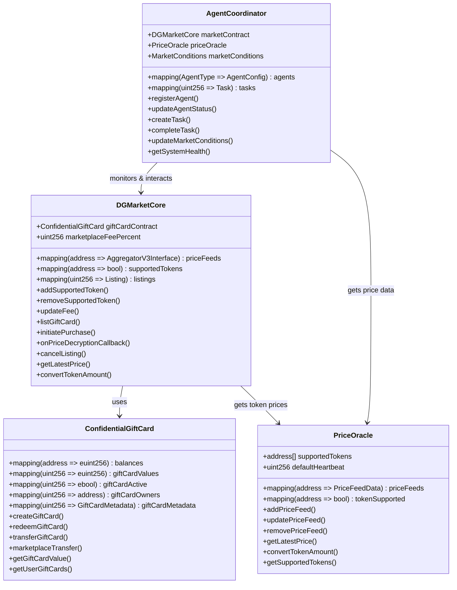

```mermaid
classDiagram
    %% Color definitions for contracts
    classDef marketCore fill:#ff9e64,stroke:#333,stroke-width:2px,color:black
    classDef giftCard fill:#7aa2f7,stroke:#333,stroke-width:2px,color:black
    classDef agent fill:#bb9af7,stroke:#333,stroke-width:2px,color:black
    classDef oracle fill:#9ece6a,stroke:#333,stroke-width:2px,color:black

    class DGMarketCore {
        +ConfidentialGiftCard giftCardContract
        +mapping(address => AggregatorV3Interface) priceFeeds
        +mapping(address => bool) supportedTokens
        +uint256 marketplaceFeePercent
        +mapping(uint256 => Listing) listings
        +addSupportedToken()
        +removeSupportedToken()
        +updateFee()
        +listGiftCard()
        +initiatePurchase()
        +onPriceDecryptionCallback()
        +cancelListing()
        +getLatestPrice()
        +convertTokenAmount()
    }

    class ConfidentialGiftCard {
        +mapping(address => euint256) balances
        +mapping(uint256 => euint256) giftCardValues
        +mapping(uint256 => ebool) giftCardActive
        +mapping(uint256 => address) giftCardOwners
        +mapping(uint256 => GiftCardMetadata) giftCardMetadata
        +createGiftCard()
        +redeemGiftCard()
        +transferGiftCard()
        +marketplaceTransfer()
        +getGiftCardValue()
        +getUserGiftCards()
    }

    class AgentCoordinator {
        +DGMarketCore marketContract
        +PriceOracle priceOracle
        +mapping(AgentType => AgentConfig) agents
        +mapping(uint256 => Task) tasks
        +MarketConditions marketConditions
        +registerAgent()
        +updateAgentStatus()
        +createTask()
        +completeTask()
        +updateMarketConditions()
        +getSystemHealth()
    }

    class PriceOracle {
        +mapping(address => PriceFeedData) priceFeeds
        +address[] supportedTokens
        +mapping(address => bool) tokenSupported
        +uint256 defaultHeartbeat
        +addPriceFeed()
        +updatePriceFeed()
        +removePriceFeed()
        +getLatestPrice()
        +convertTokenAmount()
        +getSupportedTokens()
    }

    %% Relationships with colored arrows
    DGMarketCore --> ConfidentialGiftCard : uses
    AgentCoordinator --> DGMarketCore : monitors & interacts
    AgentCoordinator --> PriceOracle : gets price data
    DGMarketCore --> PriceOracle : gets token prices
    
    %% Apply colors to classes
    class DGMarketCore:::marketCore
    class ConfidentialGiftCard:::giftCard
    class AgentCoordinator:::agent
    class PriceOracle:::oracle
```
